# 病态函数基准对照（v0.3 核心验收）

> 判定标准：**逐条与本表 JSXGraph 1.13.3 基准图比对，特征一致即通过**（不要求像素级相同）。
> 基准图生成方式见 [README.md](README.md)。左侧为 JSXGraph 1.13.3（`boundingbox` 与右侧完全相同的数值视口），
> 右侧为本实现（同一个 `range=` 视口参数）。

## 1. `tan(x)` —— 渐近线处断开

| JSXGraph 基准 | 本实现 |
|---|---|
| 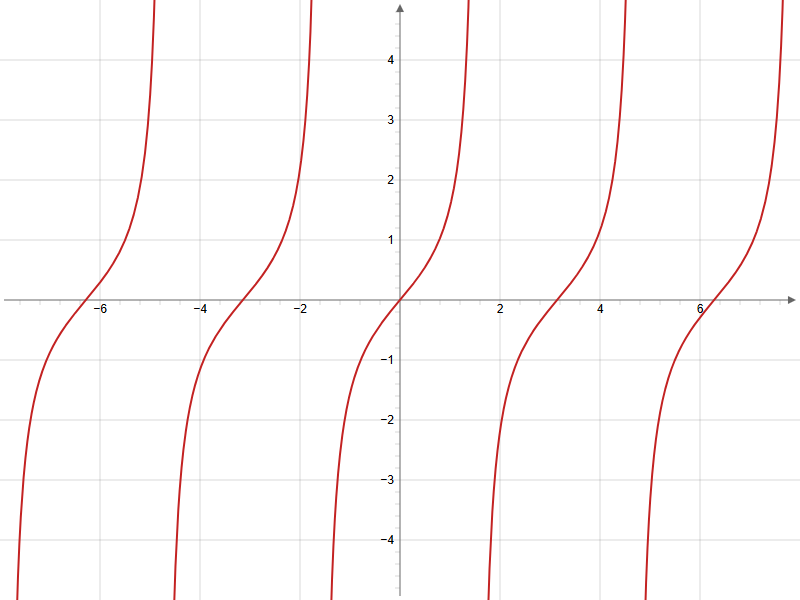 | 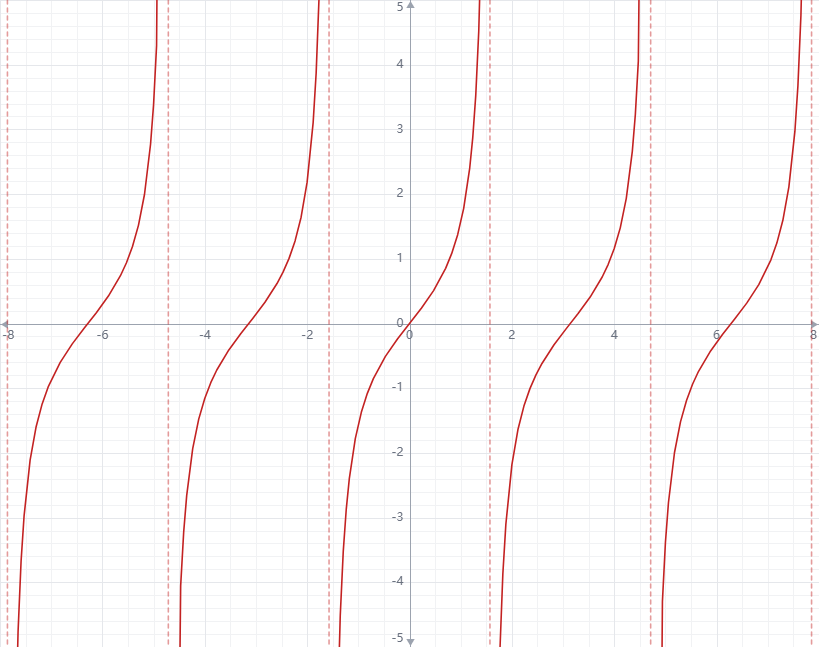 |

**特征核对**：渐近线处断开、无竖直连线 ✅；两分支各自冲向 ±∞ ✅；本实现额外用红色虚线标注检测到的渐近线（规格要求的增强）。

## 2. `sin(1/x)` —— 0 附近高频振荡被捕捉

| JSXGraph 基准 | 本实现 |
|---|---|
| 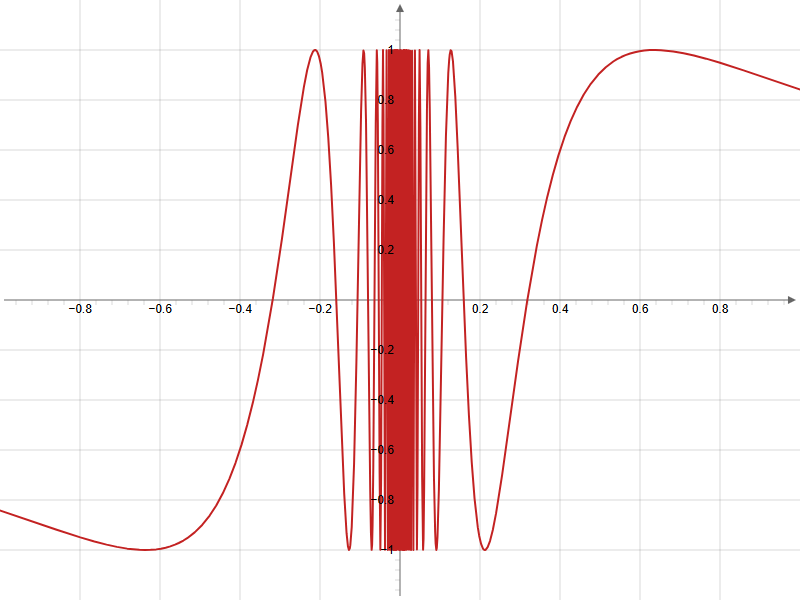 | 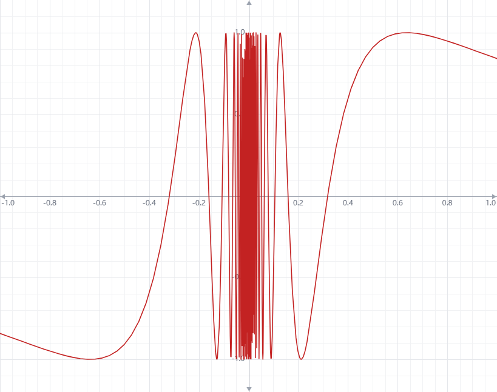 |

**特征核对**：外围振荡波形一致 ✅；0 附近为密集红带（超出像素分辨率的振荡，两者表现相同）✅；无死循环、无跨区连线 ✅。

## 3. `x*sin(1/x)` —— 0 附近收敛到 0，振荡可见

| JSXGraph 基准 | 本实现 |
|---|---|
| 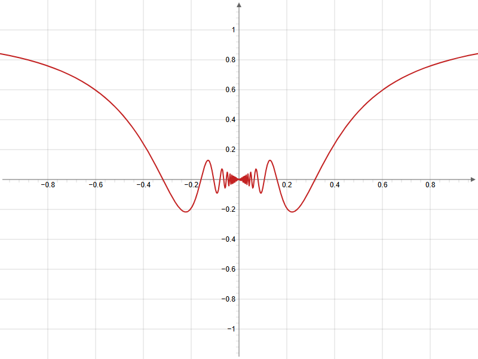 | 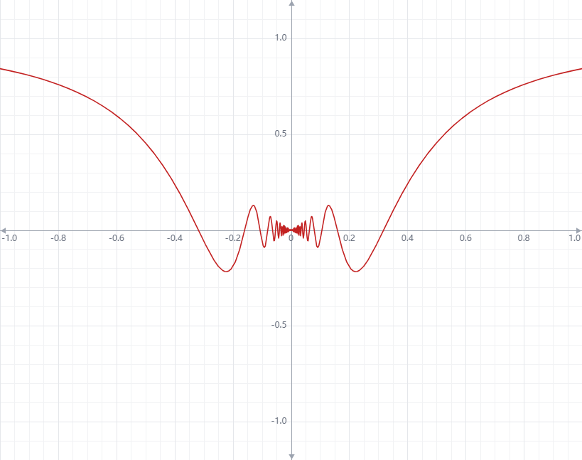 |

**特征核对**：包络收敛到 0 ✅；振荡可见 ✅。

## 4. `1/(x²-1)` —— x=±1 处两条渐近线断开

| JSXGraph 基准 | 本实现 |
|---|---|
| 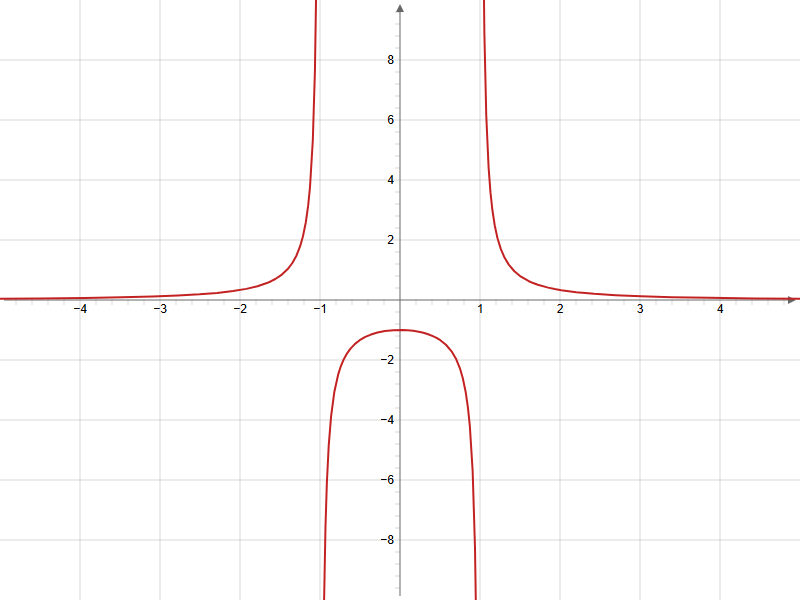 | 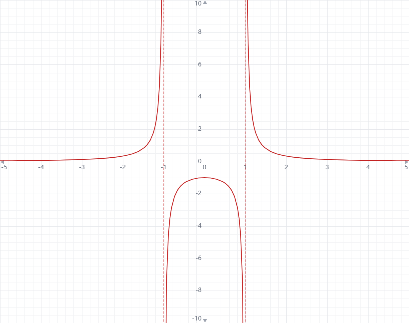 |

**特征核对**：±1 处断开 ✅；两虚线渐近线（本实现增强）✅；三条分支形状与基准一致 ✅。

## 5. `sqrt(x)` —— x<0 区域完全不绘制

| JSXGraph 基准 | 本实现 |
|---|---|
| 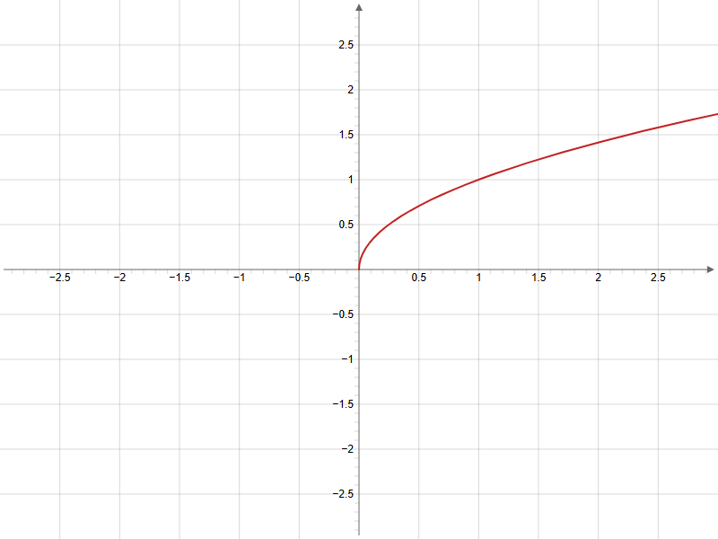 | 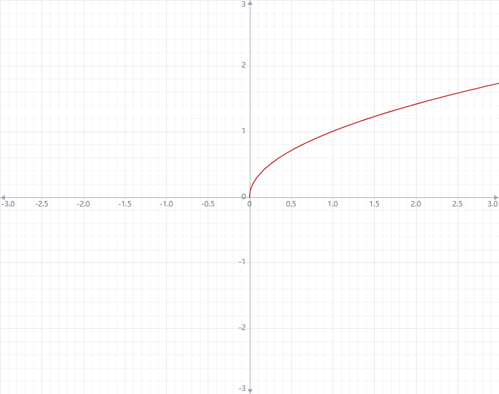 |

**特征核对**：x<0 无任何曲线点 ✅；原点处从 0 开始 ✅。

## 6. `ln(x)` —— x≤0 区域完全不绘制

| JSXGraph 基准 | 本实现 |
|---|---|
| 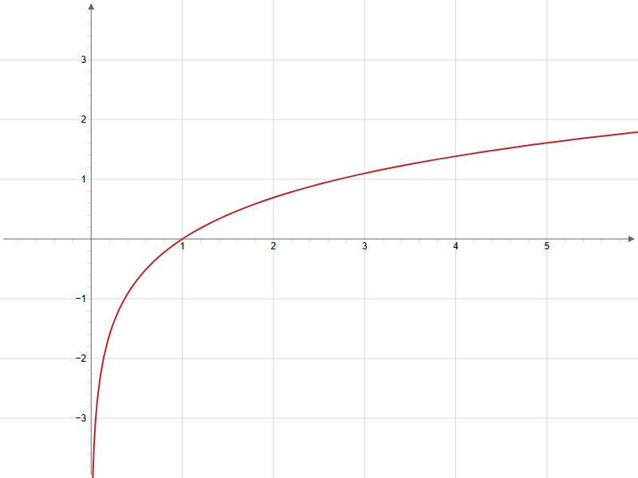 | 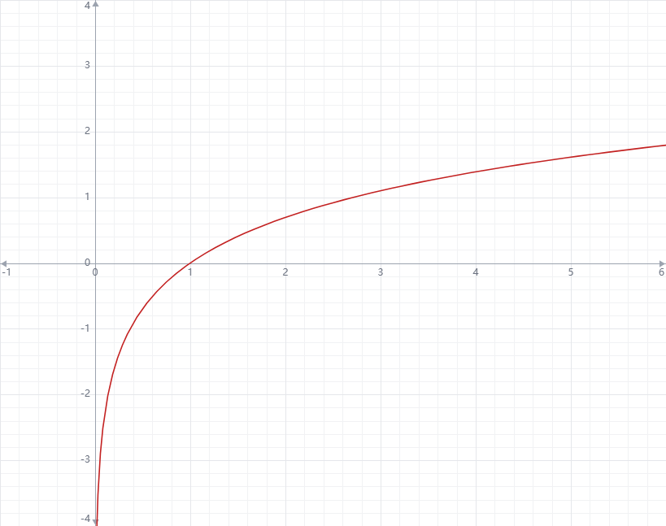 |

**特征核对**：x≤0 无曲线 ✅；向 0⁺ 下落形态一致 ✅。

## 7. `floor(x)` —— 台阶处垂直（不斜切）

| JSXGraph 基准 | 本实现 |
|---|---|
| 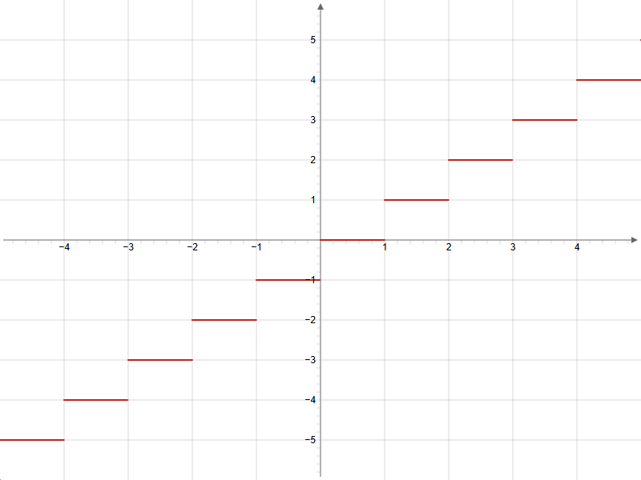 | 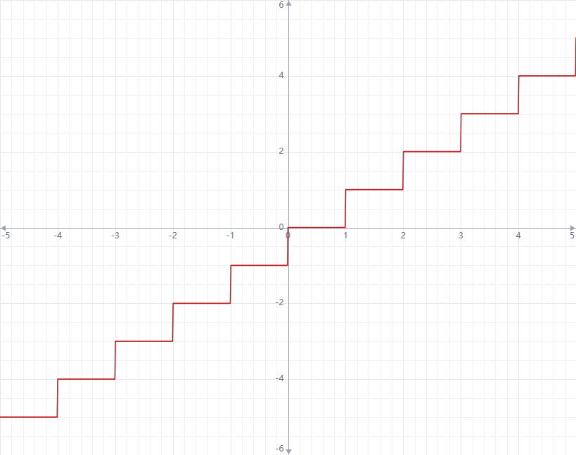 |

**特征核对**：阶梯清晰 ✅；台阶处垂直连线（不断开、不斜切）✅。

## 8. `abs(x)/x` —— x=0 处断开（不是从 -1 直连到 1）

| JSXGraph 基准 | 本实现 |
|---|---|
| 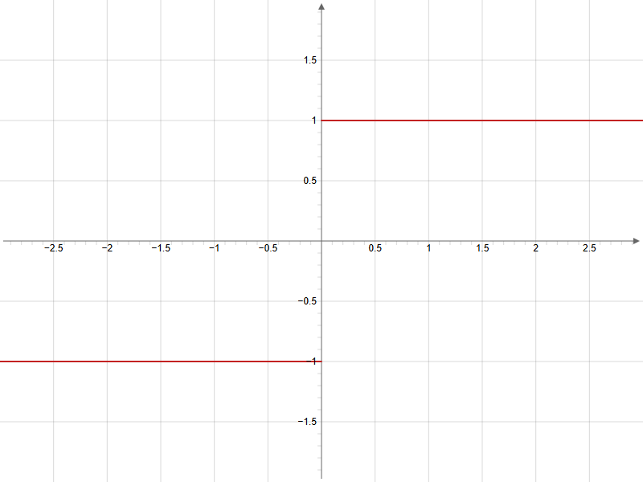 | 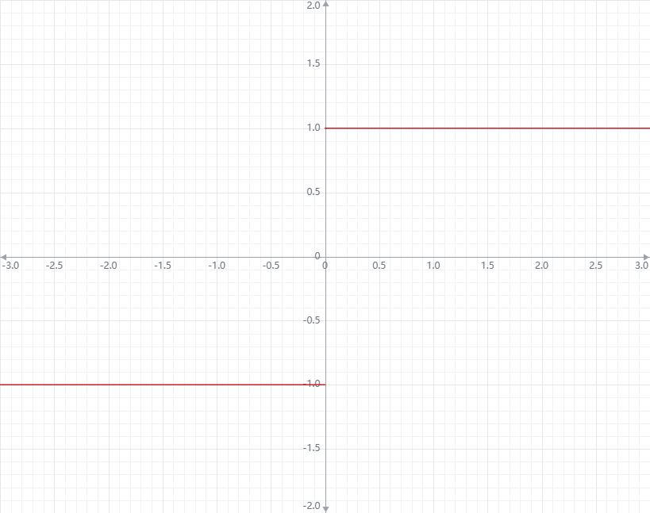 |

**特征核对**：x=0 两侧断开，无竖直连线 ✅；两水平分支位置一致 ✅。

## 9. `exp(-x²)` —— 钟形曲线平滑

| JSXGraph 基准 | 本实现 |
|---|---|
| 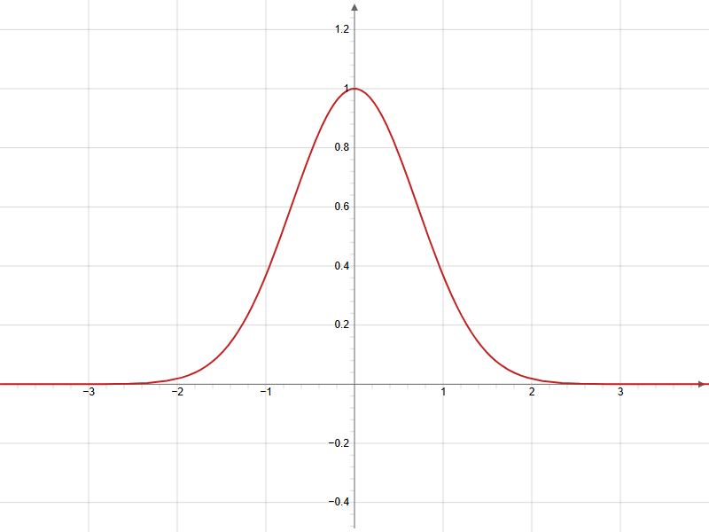 | 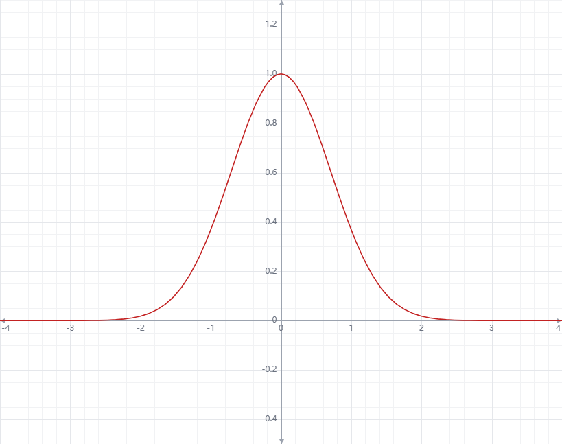 |

**特征核对**：钟形平滑 ✅。

## 10. `x²` 在 x∈[1e5, 1e5+10] —— 极端缩放下仍能画出

| JSXGraph 基准 | 本实现 |
|---|---|
| 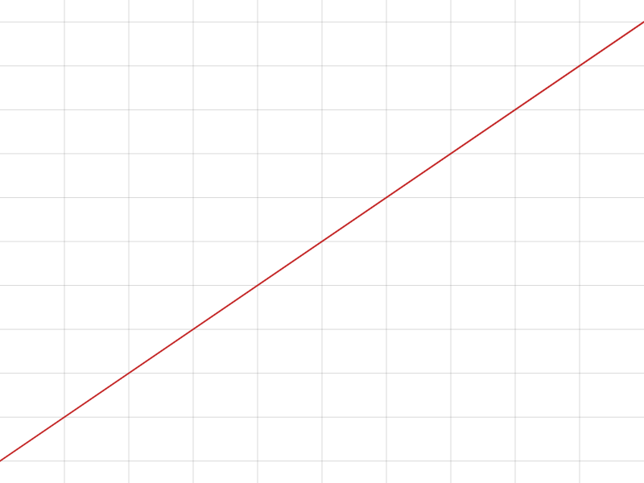 | 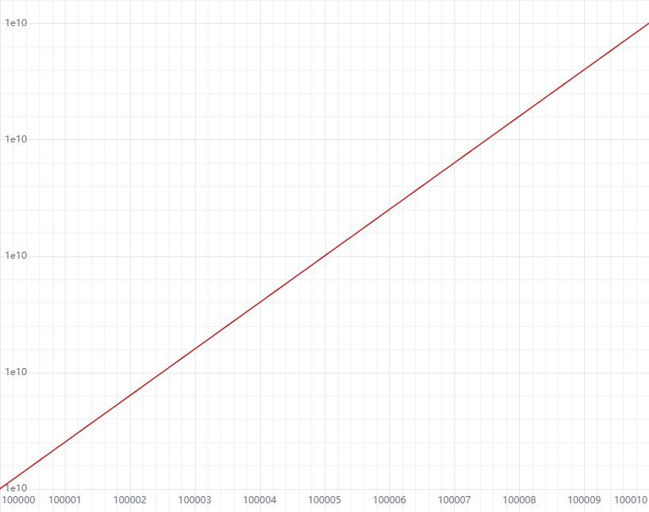 |

**特征核对**：极端中心偏移（1e5 / 1e10 量级）下正常绘制 ✅；x 轴刻度 100000–100010 可读 ✅；y 轴以 `1e10` 指数标签显示 ✅。

> 本用例曾暴露一个真实缺陷：视图中心在单位空间被错误钳制到 ±300，导致坐标绝对值大于 300 后
> 网格整体错位。**基准图对照机制当场捕获了它**（`viewBounds` 返回 295~305 而非 100000~100010），
> 修复见 `src/core/transform.ts` 的 `centerUnits` 与 `src/core/transform.test.ts` 回归用例。

---

## 结论

| # | 用例 | 特征一致 |
|---|---|---|
| 1 | tan(x) | ✅ |
| 2 | sin(1/x) | ✅ |
| 3 | x·sin(1/x) | ✅ |
| 4 | 1/(x²−1) | ✅ |
| 5 | sqrt(x) | ✅ |
| 6 | ln(x) | ✅ |
| 7 | floor(x) | ✅ |
| 8 | abs(x)/x | ✅ |
| 9 | exp(−x²) | ✅ |
| 10 | x² 极端缩放 | ✅ |
